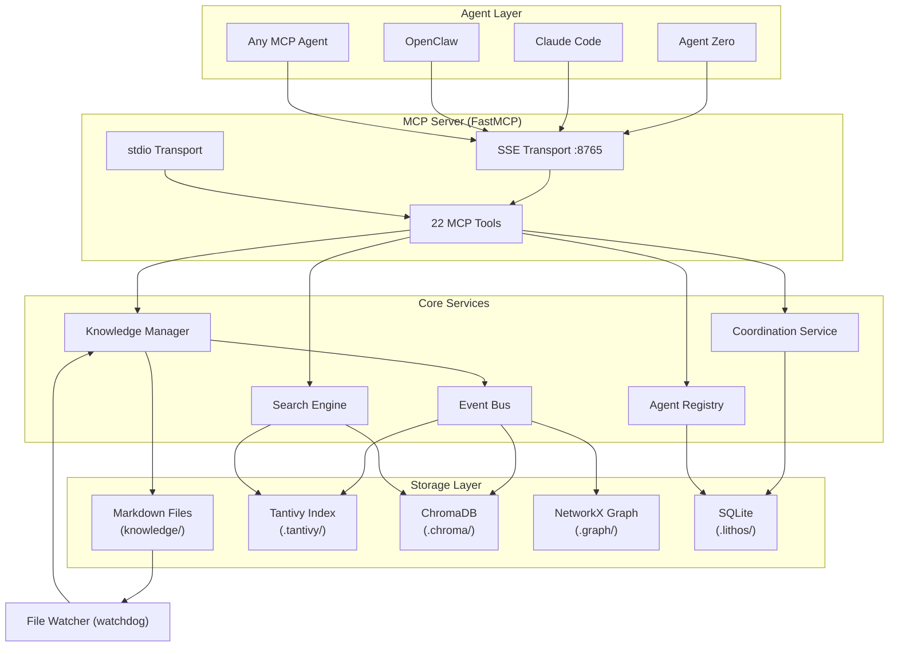
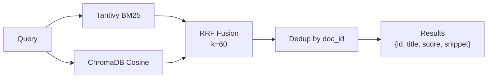

# Architecture

## System Diagram



---

## Component Overview

### MCP Server (FastMCP)

The entry point for all agent interactions. Exposes 22 tools via:

- **SSE (Server-Sent Events)** — HTTP-based, for network agents (Agent Zero, remote Claude Code, OpenClaw)
- **stdio** — process-based, for local MCP clients (Claude Desktop)

FastMCP handles argument validation, serialization, and MCP protocol compliance.

### Knowledge Manager

Handles all reads and writes to the Markdown knowledge base:

- Assigns UUIDs on creation
- Normalises slugs (URL-safe, lowercase, hyphens)
- Manages YAML frontmatter (author, timestamps, version, contributors)
- Deduplicates writes by `source_url` (normalised)
- Enforces the `expected_version` optimistic lock on updates
- Emits events to the Event Bus after mutations

### Search Engine

Dual-backend search with unified result format:



**Chunking:** Documents are split into ~500 character chunks (on paragraph boundaries, max 1000) before embedding. Semantic search operates over chunks and deduplicates to document level before returning results.

**Hybrid mode (default):** Merges BM25 and cosine similarity rankings using Reciprocal Rank Fusion. RRF is robust to score scale differences — rank matters, not magnitude.

### Coordination Service

Manages tasks, claims, findings, and agent state in SQLite:

```sql
-- Key tables
tasks (id, title, description, status, tags, agent, created_at)
claims (task_id, aspect, agent, expires_at)
findings (id, task_id, agent, summary, knowledge_id, created_at)
agents (id, name, type, first_seen_at, last_seen_at, metadata)
```

Claims use TTL expiry: the `expires_at` timestamp is set when a claim is created or renewed. Expired claims are filtered at query time — no background cleanup job is needed.

### Event Bus

An in-memory publish/subscribe bus that decouples the Knowledge Manager from the indexers:

- Ring buffer of last 500 events
- Per-subscriber queues (max 100)
- SSE delivery to external consumers via `GET /events`
- Events include: `doc_created`, `doc_updated`, `doc_deleted`, `reindex_complete`

### File Watcher (watchdog)

Watches the `knowledge/` directory for filesystem changes (e.g., files edited directly in Obsidian). Debounces changes (default 500ms) and triggers incremental index updates automatically.

---

## Data Flow

### Write Path

```
Agent → lithos_write
  → Knowledge Manager
    → Validate & normalise input
    → Check source_url dedup
    → Check version conflict (if expected_version provided)
    → Write Markdown file
    → Update graph cache (parse wiki-links)
    → Emit doc_created / doc_updated event
      → Search Engine: update Tantivy + ChromaDB
  → Return status envelope
```

### Read Path

```
Agent → lithos_search(query, mode="hybrid")
  → Search Engine
    → Tantivy: BM25 query → ranked list
    → ChromaDB: cosine query over chunks → ranked list
    → RRF fusion → unified ranked list
    → Dedup by doc_id
  → Return results with snippets + scores
```

### Startup Sequence

1. Ensure directories and coordination DB exist
2. Check rebuild conditions (`rebuild_on_start` flag or corrupt/missing indices)
3. Load graph cache or rebuild from Markdown files
4. Pre-warm embeddings in background (first run downloads the model)
5. Start file watcher
6. Serve MCP tools

---

## Storage: Authoritative vs Rebuildable

| Path | Type | Back up? |
|------|------|---------|
| `knowledge/` | Authoritative — your Markdown | ✅ Yes |
| `.lithos/` | Authoritative — coordination DB | ✅ Yes |
| `.tantivy/` | Rebuildable index | ❌ Optional |
| `.chroma/` | Rebuildable index | ❌ Optional |
| `.graph/` | Rebuildable cache | ❌ Optional |

To rebuild all indices from scratch:

```bash
lithos reindex --clear
```

---

## Tech Stack

| Layer | Technology | Why |
|-------|-----------|-----|
| MCP framework | FastMCP | Pythonic MCP server with minimal boilerplate |
| Full-text search | Tantivy (via tantivy-py) | Rust-speed BM25, Lucene-compatible query syntax |
| Semantic search | ChromaDB | Embedded vector store, no external service |
| Embeddings | sentence-transformers | Local CPU inference, no API keys |
| Knowledge graph | NetworkX | In-memory graph traversal, rebuildable |
| Coordination state | SQLite | ACID, zero-dependency, runs anywhere |
| File watching | watchdog | Cross-platform inotify/kqueue/FSEvents |
| CLI | Click | Composable commands with `--help` |
| Package management | uv | Fast, reproducible Python environments |
