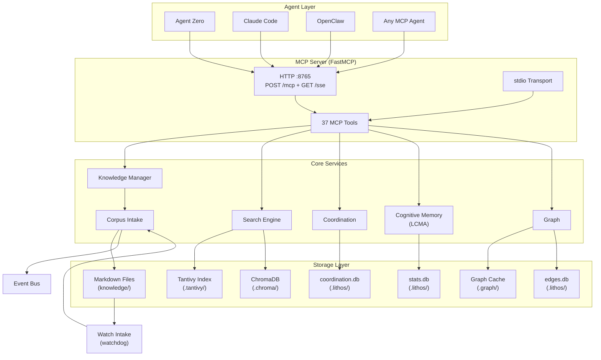
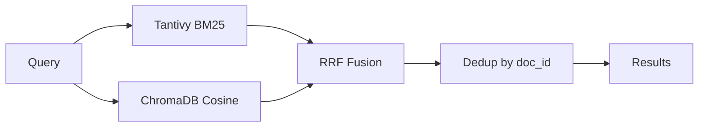

# Architecture

## System Diagram


```mermaid
graph TB
    subgraph Agents["Agent Layer"]
        AZ["Agent Zero"]
        CC["Claude Code"]
        OC["OpenClaw"]
        XX["Any MCP Agent"]
    end

    subgraph MCP["MCP Server (FastMCP)"]
        TOOLS["37 MCP Tools"]
        HTTP["HTTP :8765\nPOST /mcp + GET /sse"]
        STDIO["stdio Transport"]
    end

    subgraph Core["Core Services"]
        KM["Knowledge Manager"]
        CI["Corpus Intake"]
        SE["Search Engine"]
        GR["Graph"]
        CS["Coordination"]
        CM["Cognitive Memory\n(LCMA)"]
    end

    subgraph Storage["Storage Layer"]
        MD["Markdown Files\n(knowledge/)"]
        ED["edges.db\n(.lithos/)"]
        SQ["coordination.db\n(.lithos/)"]
        ST["stats.db\n(.lithos/)"]
        TV["Tantivy Index\n(.tantivy/)"]
        CH["ChromaDB\n(.chroma/)"]
        NX["Graph Cache\n(.graph/)"]
    end

    FW["Watch Intake\n(watchdog)"]
    EB["Event Bus"]

    AZ & CC & OC & XX --> HTTP
    HTTP & STDIO --> TOOLS
    TOOLS --> KM & SE & CS & CM & GR
    KM --> CI
    CI --> MD
    CI --> EB
    SE --> TV & CH
    GR --> NX & ED
    CS --> SQ
    CM --> ST
    FW --> CI
    MD --> FW
```

The full, drift-checked component view (17 components across three tiers, with dependency budgets enforced in CI) lives in the lithos repo under [`docs/generated/`](https://github.com/agent-lore/lithos/tree/main/docs/generated).

---

## Component Overview

### MCP Server (FastMCP)

The entry point for all agent interactions. Exposes 37 tools via:

- **stdio** — process-based, for local MCP clients (Claude Desktop)
- **http** — one port serving both `POST /mcp` (StreamableHTTP, MCP 2025-03-26+, **stateless**) and `GET /sse` (legacy SSE), plus the `/health`, `/events`, and `/audit` routes

StreamableHTTP sessions carry no server-side state — everything lives in SQLite/Tantivy/Chroma — so restarts and load-balancing are safe.

### Knowledge Manager & Corpus Intake

All corpus mutations flow through a single intake seam, whether they arrive from `lithos_write` or from the file watcher noticing an Obsidian edit:

- Assigns UUIDs on creation, normalises slugs
- Manages YAML frontmatter (author, timestamps, version, contributors, free-form metadata)
- Deduplicates writes by normalised `source_url`
- Enforces the `expected_version` optimistic lock
- Keeps search indices and graph views in sync, and emits events after mutations

### Search Engine

Dual-backend search behind one interface:


```mermaid
flowchart LR
    Q["Query"] --> BM25["Tantivy BM25"]
    Q --> VEC["ChromaDB Cosine"]
    BM25 --> RRF["RRF Fusion"]
    VEC --> RRF
    RRF --> DEDUP["Dedup by doc_id"]
    DEDUP --> OUT["Results"]
```

**Chunking:** documents are split into ~500-character chunks (paragraph boundaries, max 1000) before embedding; semantic search operates over chunks and deduplicates to document level.

**Hybrid mode (default):** merges BM25 and cosine rankings with Reciprocal Rank Fusion — robust to score-scale differences because rank matters, not magnitude.

### Cognitive Memory (LCMA)

The learning layer behind `lithos_retrieve`, `lithos_cache_lookup`, and `lithos_node_stats`. Runs retrieval scouts over the other backends, reranks by learned salience and usage, writes audit receipts, and applies reinforcement feedback from `lithos_task_complete`. A background enrichment worker extracts entities and — when an LLM endpoint is configured — infers typed edges between related notes.

### Coordination

Tasks, claims, findings, task edges, and agent state in SQLite:

```sql
-- Key tables (abridged)
tasks      (id, title, description, status, task_type, tags, metadata,
            created_by, created_at, resolved_at, updated_at, outcome)
task_edges (from_task_id, to_task_id, type, metadata, created_by, created_at)
claims     (task_id, aspect, agent, expires_at)   -- UNIQUE(task_id, aspect)
findings   (id, task_id, agent, summary, knowledge_id, created_at)
agents     (id, name, type, first_seen_at, last_seen_at, metadata)
```

Claims use TTL expiry — expired claims are filtered at query time, no background cleanup job. Readiness (`lithos_task_ready`) is computed at query time from edges and status; Lithos never polls external systems.

### Event Bus

An in-memory publish/subscribe bus:

- Ring buffer of the last 500 events (SSE replay via `Last-Event-ID`, with a `resync` control event when the reconnect id fell off the ring)
- Per-subscriber bounded queues; slow subscribers drop rather than block
- Delivered externally via `GET /events`
- Event types: `note.*` (created/updated/deleted/renamed), `task.*` (created/updated/claimed/released/completed/cancelled/reopened), `edge.upserted`, `finding.posted`, `agent.registered`

Best-effort and process-local — treat it as a cache-invalidation hint, not a durable log.

### Watch Intake (watchdog)

Watches `knowledge/` for filesystem changes — Obsidian edits, `mv`, `git checkout`. Debounces (default 500 ms), preserves document ids across renames, and routes changes through the same intake seam as MCP writes, so external edits emit the same events with the same payloads.

---

## Data Flow

### Write Path

```
Agent → lithos_write
  → Corpus Intake
    → Validate & normalise input
    → Check source_url dedup / slug & path collisions
    → Check version conflict (if expected_version provided)
    → Write Markdown file
    → Sync Tantivy + ChromaDB + graph views
    → Emit note.created / note.updated
  → Return status envelope
```

### Read Path

```
Agent → lithos_search(query, mode="hybrid")
  → Search Engine
    → Tantivy BM25 + ChromaDB cosine, RRF-fused, deduped
  → Record read-access audit entries
  → Return results with snippets + scores
```

### Startup Sequence

1. Ensure directories and SQLite stores exist (migrating schemas in place)
2. Check rebuild conditions (`rebuild_on_start`, corrupt/missing indices)
3. Load graph cache or rebuild from Markdown
4. Pre-warm embeddings in background (first run downloads the model)
5. Start the file watcher
6. Serve MCP tools

---

## Storage: Authoritative vs Rebuildable

| Path | Type | Back up? |
|------|------|---------|
| `knowledge/` | Authoritative — your Markdown | ✅ Yes |
| `.lithos/coordination.db` | Authoritative — tasks, claims, findings, agents | ✅ Yes |
| `.lithos/edges.db` | Authoritative — asserted typed edges | ✅ Yes |
| `.lithos/stats.db` | Agent state — salience, receipts, working memory | ✅ Recommended |
| `.tantivy/` | Rebuildable index | ❌ Optional |
| `.chroma/` | Rebuildable index | ❌ Optional |
| `.graph/` | Rebuildable cache | ❌ Optional |

To rebuild all indices from scratch: `lithos reindex --clear`. To repair derived state without touching Markdown: `lithos reconcile`.

---

## Tech Stack

| Layer | Technology | Why |
|-------|-----------|-----|
| MCP framework | FastMCP | Pythonic MCP server; stdio, StreamableHTTP, and SSE transports |
| Full-text search | Tantivy (via tantivy-py) | Rust-speed BM25, Lucene-compatible query syntax |
| Semantic search | ChromaDB | Embedded vector store, no external service |
| Embeddings | sentence-transformers | Local CPU/GPU inference, no API keys |
| Entity extraction | spaCy (`en_core_web_sm`) | Local NER + corroborated heuristics |
| Knowledge graph | NetworkX | In-memory wiki-link traversal, rebuildable |
| Coordination & memory state | SQLite | ACID, zero-dependency, runs anywhere |
| File watching | watchdog | Cross-platform inotify/kqueue/FSEvents |
| Config | pydantic-settings | Typed YAML + env layering |
| CLI | Click | Composable commands with `--help` |
| Package management | uv | Fast, reproducible Python environments |
