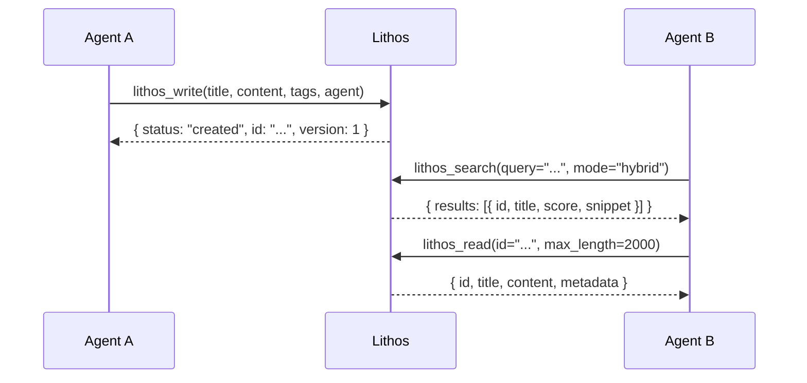
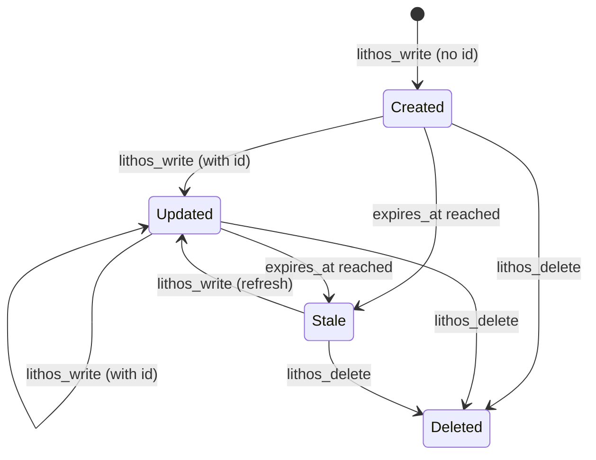
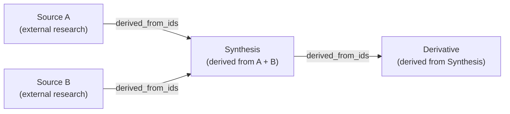

# Memory Model

Understanding how Lithos models agent memory helps you use it effectively — and avoid common pitfalls.

## The Basics: Write, Search, Read

The core knowledge cycle is simple:



This three-step pattern is the foundation. Everything else builds on it.

---

## Knowledge Item Lifecycle



### Freshness

Every knowledge item can have an `expires_at` timestamp. When the deadline passes, the item is marked `is_stale: true` in search results — but it's never deleted automatically.

Use `ttl_hours` for relative freshness windows on write:

```python
# This note will be stale after 24 hours
lithos_write(
    title="Current BTC price",
    content="$82,400 as of 2026-03-18",
    ttl_hours=24,
    agent="price-watcher"
)
```

Check for a fresh cached answer before doing expensive research:

```python
result = lithos_cache_lookup(
    query="current bitcoin price",
    max_age_hours=1,
    min_confidence=0.8
)

if result["hit"]:
    # Use cached result
    print(result["document"]["content"])
elif result["stale_exists"]:
    # Update the stale document
    lithos_write(
        id=result["stale_id"],
        content="...",  # updated content
        agent="price-watcher"
    )
else:
    # Cache miss — go fetch fresh data
    ...
```

### Versioning

Every document has a `version` integer in its frontmatter, starting at 1 and incrementing on each update. This enables optimistic concurrency control:

```python
# Read the current version
doc = lithos_read(id="abc-123")
current_version = doc["metadata"]["version"]  # e.g. 3

# Update with version guard
lithos_write(
    id="abc-123",
    content="Updated content...",
    expected_version=3,  # will fail if another agent updated first
    agent="my-agent"
)
# If another agent updated between read and write:
# → { "status": "error", "code": "version_conflict", "current_version": 4 }
```

---

## Provenance

Lithos tracks **knowledge lineage** — where a document's knowledge came from.



When writing a synthesis document:

```python
lithos_write(
    title="Comprehensive async patterns guide",
    content="...",
    derived_from_ids=["uuid-of-source-a", "uuid-of-source-b"],
    agent="synthesis-agent"
)
```

Query the lineage graph:

```python
# What did this synthesis come from?
lithos_provenance(id="synthesis-uuid", direction="sources", depth=2)

# What was derived from this document?
lithos_provenance(id="source-a-uuid", direction="derived")
```

---

## Multi-Agent Patterns

### Pattern 1: Research Caching

Before doing expensive web research, check if another agent already has the answer:

```python
cache = lithos_cache_lookup(
    query="FastAPI rate limiting middleware",
    source_url="https://fastapi.tiangolo.com/advanced/middleware/",
    max_age_hours=168  # one week
)

if not cache["hit"]:
    # Do the research
    result = web_search("FastAPI rate limiting middleware")
    lithos_write(
        title="FastAPI rate limiting middleware",
        source_url="https://fastapi.tiangolo.com/advanced/middleware/",
        content=result,
        ttl_hours=168,
        agent="research-agent"
    )
```

### Pattern 2: Parallel Work Division

```python
# Orchestrator creates a task
task = lithos_task_create(
    title="Audit Python dependencies for security issues",
    agent="orchestrator"
)

# Worker agents claim different packages
for package in ["requests", "sqlalchemy", "pydantic"]:
    lithos_task_claim(
        task_id=task["task_id"],
        aspect=f"audit:{package}",
        agent=f"worker-{package}",
        ttl_minutes=30
    )

# Workers post findings
lithos_finding_post(
    task_id=task["task_id"],
    agent="worker-requests",
    summary="requests 2.28.x has no critical CVEs",
    knowledge_id="uuid-of-detailed-note"
)

# Orchestrator reviews findings
findings = lithos_finding_list(task_id=task["task_id"])

# Mark complete
lithos_task_complete(task_id=task["task_id"], agent="orchestrator")
```

### Pattern 3: Negative Knowledge

Agents can write notes about things that *don't* work — a pattern not widely documented but powerful:

```python
lithos_write(
    title="[DONT] Use asyncio.run() inside a running event loop",
    content="""This causes a RuntimeError: "This event loop is already running."

**What to do instead:** Use `await coroutine()` directly, or use
`asyncio.ensure_future()` if you need a fire-and-forget.

**Context:** Discovered when trying to use asyncio.run() in a Jupyter notebook.
""",
    tags=["asyncio", "antipattern", "dont"],
    agent="debug-agent"
)
```

Agents can then search for `tags=["dont"]` before attempting something they might fail at.

---

## ID vs Path

Every knowledge item has two identifiers:

| Identifier | Format | Use for |
|-----------|--------|---------|
| `id` (UUID) | `f47ac10b-58cc-4372-a567-0e02b2c3d479` | Stable programmatic reference. Use in `lithos_read`, `lithos_write` (update), `lithos_delete`, `derived_from_ids`. |
| `path` (slug) | `python-asyncio-gather-patterns.md` | Human-readable filename. Shown in results. Rename-safe via `[[wiki-links]]`. |

!!! tip
    Always use `id` when referencing documents programmatically. Paths can change if you rename a file in Obsidian; the `id` in the frontmatter is stable.
