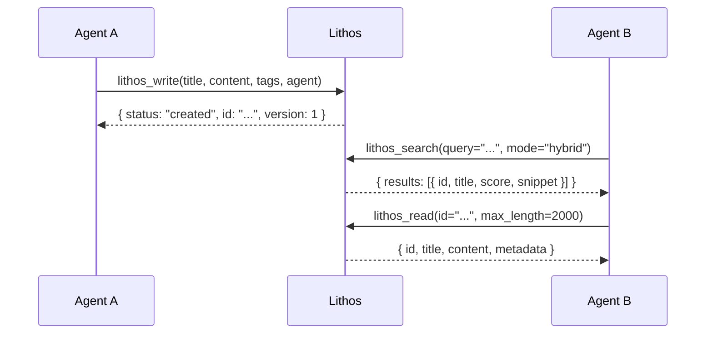
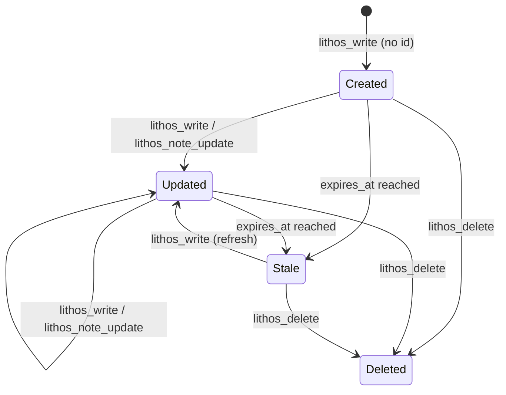
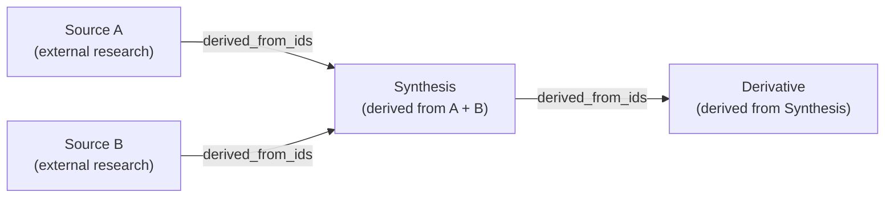

# Memory Model

Understanding how Lithos models agent memory helps you use it effectively — and avoid common pitfalls.

## The Basics: Write, Search, Read

The core knowledge cycle is simple:


```mermaid
sequenceDiagram
    participant A as Agent A
    participant L as Lithos
    participant B as Agent B

    A->>L: lithos_write(title, content, tags, agent)
    L-->>A: { status: "created", id: "...", version: 1 }

    B->>L: lithos_search(query="...", mode="hybrid")
    L-->>B: { results: [{ id, title, score, snippet }] }

    B->>L: lithos_read(id="...", max_length=2000)
    L-->>B: { id, title, content, metadata }
```

This three-step pattern is the foundation. Everything else builds on it.

---

## Knowledge Item Lifecycle


```mermaid
stateDiagram-v2
    [*] --> Created : lithos_write (no id)
    Created --> Updated : lithos_write / lithos_note_update
    Updated --> Updated : lithos_write / lithos_note_update
    Created --> Stale : expires_at reached
    Updated --> Stale : expires_at reached
    Stale --> Updated : lithos_write (refresh)
    Created --> Deleted : lithos_delete
    Updated --> Deleted : lithos_delete
    Stale --> Deleted : lithos_delete
```

Two write tools serve different jobs: `lithos_write` carries the full body; [`lithos_note_update`](../mcp-tools/knowledge-write.md#lithos_note_update) patches frontmatter (tags, metadata, title, status) **without** resending the body — use it for metadata-only changes so you never risk clobbering content you didn't mean to touch.

Notes also carry a `status` (`active` / `archived` / `quarantined`) — quarantined notes are excluded from search and retrieval. Quarantine can happen automatically when a note collects repeated "misleading" feedback (see below).

### Freshness

Every knowledge item can have an `expires_at` timestamp. When the deadline passes, the item is marked `is_stale: true` in search results — but it's never deleted automatically.

Use `ttl_hours` for relative freshness windows on write:

```python
# This note will be stale after 24 hours
lithos_write(
    title="Current BTC price",
    content="$82,400 as of 2026-09-05",
    ttl_hours=24,
    agent="price-watcher"
)
```

Check for a fresh cached answer before doing expensive research:

```python
result = lithos_cache_lookup(
    query="current bitcoin price",
    max_age_hours=1,
    min_confidence=0.8
)

if result["hit"]:
    print(result["document"]["content"])
elif result["stale_exists"]:
    # Refresh the stale document instead of writing a duplicate
    lithos_write(id=result["stale_id"], content="...", agent="price-watcher")
else:
    ...  # clean miss — go fetch fresh data
```

### Versioning

Every document has a `version` integer in its frontmatter, starting at 1 and incrementing on each update. This enables optimistic concurrency control:

```python
doc = lithos_read(id="abc-123")
current_version = doc["metadata"]["version"]  # e.g. 3

lithos_write(
    id="abc-123",
    content="Updated content...",
    expected_version=3,  # will fail if another agent updated first
    agent="my-agent"
)
# If another agent updated between read and write:
# → { "status": "version_conflict", "message": "...", "current_version": 4 }
```

On conflict: re-read, merge, retry. See [Envelopes, Errors & IDs](envelopes.md#optimistic-concurrency).

---

## Provenance

Lithos tracks **knowledge lineage** — where a document's knowledge came from.


```mermaid
graph LR
    S1["Source A\n(external research)"]
    S2["Source B\n(external research)"]
    S3["Synthesis\n(derived from A + B)"]
    D1["Derivative\n(derived from Synthesis)"]

    S1 -->|derived_from_ids| S3
    S2 -->|derived_from_ids| S3
    S3 -->|derived_from_ids| D1
```

When writing a synthesis document:

```python
lithos_write(
    title="Comprehensive async patterns guide",
    content="...",
    derived_from_ids=["uuid-of-source-a", "uuid-of-source-b"],
    agent="synthesis-agent"
)
```

Query the lineage (and everything else the note connects to) with [`lithos_related`](../mcp-tools/knowledge-read.md#lithos_related):

```python
rel = lithos_related(id="synthesis-uuid", include=["provenance"], depth=2)
rel["provenance"]["sources"]   # what it came from
rel["provenance"]["derived"]   # what was built on it
```

---

## Retrieval That Learns

Beyond search, Lithos keeps per-note **cognitive state**: a salience score, retrieval counts, and penalty counters (in `stats.db`). The loop:

1. `lithos_retrieve(query=..., task_id=...)` returns ranked results **and** a `receipt_id` recording exactly which notes were surfaced.
2. The agent does the work.
3. `lithos_task_complete(..., cited_nodes=[...], misleading_nodes=[...])` reports which surfaced notes genuinely helped or misled.
4. Salience updates: cited notes get boosted, misleading notes penalized (three misleading marks quarantines a note), surfaced-but-ignored notes decay mildly. Unused notes decay slowly toward a floor.

Future retrievals rerank with the updated salience plus a non-decaying usage signal — the knowledge base gets better at answering *because it's used*. Inspect any note's state with [`lithos_node_stats`](../mcp-tools/retrieval.md#lithos_node_stats).

---

## Multi-Agent Patterns

### Pattern 1: Research Caching

Before doing expensive web research, check if another agent already has the answer:

```python
cache = lithos_cache_lookup(
    query="FastAPI rate limiting middleware",
    source_url="https://fastapi.tiangolo.com/advanced/middleware/",
    max_age_hours=168  # one week
)

if not cache["hit"]:
    result = web_search("FastAPI rate limiting middleware")
    lithos_write(
        title="FastAPI rate limiting middleware",
        source_url="https://fastapi.tiangolo.com/advanced/middleware/",
        content=result,
        ttl_hours=168,
        agent="research-agent"
    )
```

### Pattern 2: Parallel Work Division

```python
# Orchestrator creates a task
task = lithos_task_create(
    title="Audit Python dependencies for security issues",
    agent="orchestrator"
)

# Worker agents claim different aspects
for package in ["requests", "sqlalchemy", "pydantic"]:
    lithos_task_claim(
        task_id=task["task_id"],
        aspect=f"audit:{package}",
        agent=f"worker-{package}",
        ttl_minutes=30
    )

# Workers post findings as they go
lithos_finding_post(
    task_id=task["task_id"],
    agent="worker-requests",
    summary="requests 2.28.x has no critical CVEs",
    knowledge_id="uuid-of-detailed-note"
)

# Orchestrator reviews findings and completes
findings = lithos_finding_list(task_id=task["task_id"])
lithos_task_complete(task_id=task["task_id"], agent="orchestrator",
                     outcome="All three packages clean")
```

For larger workflows, dependencies replace polling: create tasks with `depends_on`, group them under an epic, and let workers pull from `lithos_task_ready()` — see [Task Graph](../mcp-tools/task-graph.md).

### Pattern 3: Negative Knowledge

Agents can write notes about things that *don't* work — a pattern not widely documented but powerful:

```python
lithos_write(
    title="[DONT] Use asyncio.run() inside a running event loop",
    content="""This causes a RuntimeError: "This event loop is already running."

**What to do instead:** Use `await coroutine()` directly, or
`asyncio.ensure_future()` for fire-and-forget.

**Context:** Discovered when trying to use asyncio.run() in a Jupyter notebook.
""",
    tags=["asyncio", "antipattern", "dont"],
    note_type="agent_finding",
    agent="debug-agent"
)
```

Agents can then search for `tags=["dont"]` before attempting something they might fail at.

---

## ID vs Path

Every knowledge item has two identifiers:

| Identifier | Format | Use for |
|-----------|--------|---------|
| `id` (UUID) | `f47ac10b-58cc-4372-a567-0e02b2c3d479` | Stable programmatic reference. Use in `lithos_read`, `lithos_write` (update), `lithos_delete`, `derived_from_ids`. |
| `path` (slug) | `python-asyncio-gather-patterns.md` | Human-readable filename. Shown in results. Rename-safe via `[[wiki-links]]`. |

Every id parameter also accepts an unambiguous **short prefix** (≥6 chars) — see [Envelopes, Errors & IDs](envelopes.md#short-id-prefixes).

!!! tip
    Always use `id` when referencing documents programmatically. Paths can change if you rename a file in Obsidian; the `id` in the frontmatter is stable (and Lithos preserves it across on-disk renames).
