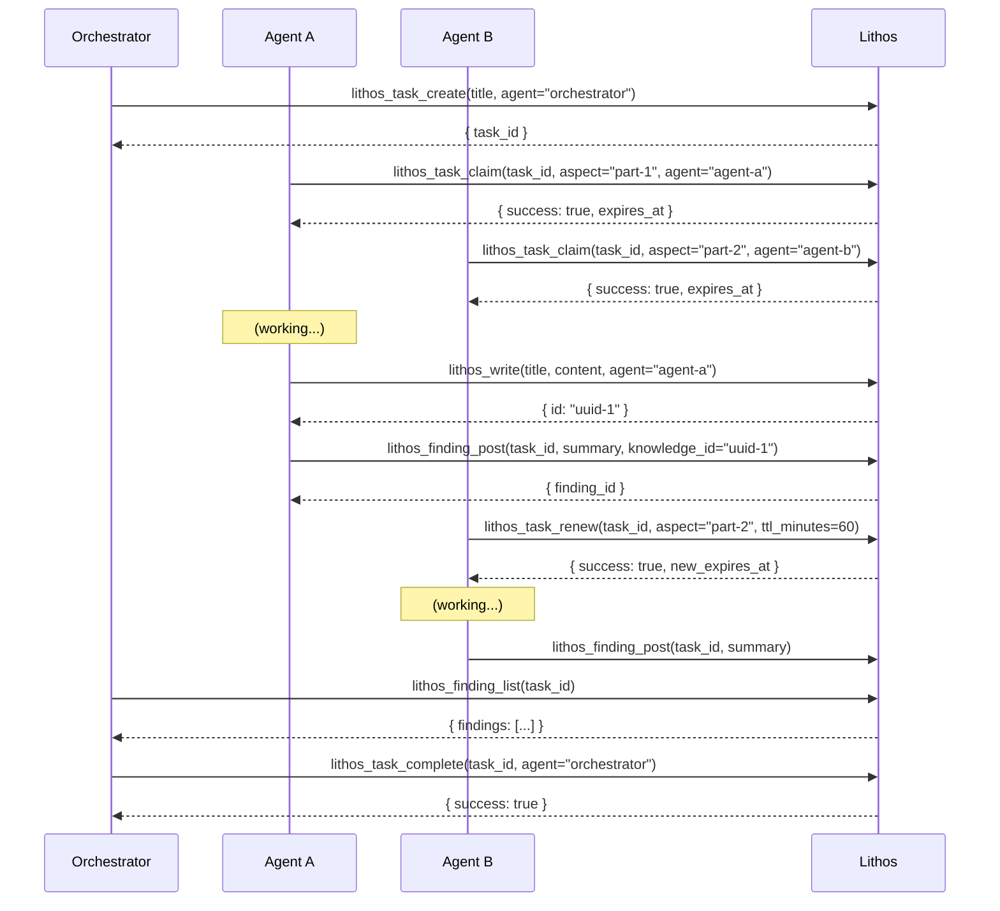

# lithos_task_status

Get the status and active claims for one or all tasks.

<div class="tool-sig">lithos_task_status([task_id])</div>

---

## Parameters

| Name | Type | Required | Description |
|------|------|:--------:|-------------|
| `task_id` | string | — | Specific task ID. Omit to get all active tasks. |

---

## Returns

```json
{
  "tasks": [
    {
      "id": "task-abc123",
      "title": "Audit Python dependencies for security issues",
      "status": "open",
      "claims": [
        {
          "agent": "worker-requests",
          "aspect": "audit:requests",
          "expires_at": "2026-03-18T13:00:00Z"
        },
        {
          "agent": "worker-sqlalchemy",
          "aspect": "audit:sqlalchemy",
          "expires_at": "2026-03-18T13:15:00Z"
        }
      ]
    }
  ]
}
```

!!! note "Claim expiry"
    Only active (non-expired) claims are returned. Expired claims are filtered at query time.

---

## Example

```python
# Check what's being worked on right now
status = lithos_task_status()
for task in status["tasks"]:
    print(f"Task: {task['title']} ({task['status']})")
    for claim in task["claims"]:
        print(f"  └── {claim['agent']} is working on: {claim['aspect']}")
        print(f"       expires: {claim['expires_at']}")
```

---

## Related Tools

The full coordination workflow involves several tools working together:

### lithos_task_create

Create a new coordination task.

<div class="tool-sig">lithos_task_create(title, agent, [description], [tags])</div>

```python
task = lithos_task_create(
    title="Research competitor memory systems",
    description="Survey the landscape of agent memory tools as of March 2026",
    tags=["research", "competitive-analysis"],
    agent="orchestrator"
)
# → { "task_id": "task-abc123" }
```

### lithos_task_claim

Claim an aspect of a task (distributed lock with TTL).

<div class="tool-sig">lithos_task_claim(task_id, aspect, agent, [ttl_minutes])</div>

```python
result = lithos_task_claim(
    task_id="task-abc123",
    aspect="mem0 analysis",
    agent="research-agent",
    ttl_minutes=60
)
# → { "success": true, "expires_at": "2026-03-18T13:00:00Z" }
# Or if aspect is taken:
# → { "status": "error", "code": "claim_failed", ... }
```

### lithos_task_renew

Extend a claim before it expires (for long-running work).

<div class="tool-sig">lithos_task_renew(task_id, aspect, agent, [ttl_minutes])</div>

```python
# Renew 10 minutes before expiry
result = lithos_task_renew(
    task_id="task-abc123",
    aspect="mem0 analysis",
    agent="research-agent",
    ttl_minutes=60  # 60 more minutes from now
)
# → { "success": true, "new_expires_at": "2026-03-18T14:00:00Z" }
```

### lithos_task_release

Release a claim early (work abandoned or handed off).

<div class="tool-sig">lithos_task_release(task_id, aspect, agent)</div>

```python
lithos_task_release(
    task_id="task-abc123",
    aspect="mem0 analysis",
    agent="research-agent"
)
# → { "success": true }
```

### lithos_task_complete

Mark the entire task as completed (releases all remaining claims).

<div class="tool-sig">lithos_task_complete(task_id, agent)</div>

```python
lithos_task_complete(task_id="task-abc123", agent="orchestrator")
# → { "success": true }
```

### lithos_finding_post

Post a finding to a task (link a knowledge item as a result).

<div class="tool-sig">lithos_finding_post(task_id, agent, summary, [knowledge_id])</div>

```python
lithos_finding_post(
    task_id="task-abc123",
    agent="research-agent",
    summary="mem0 lacks task claiming and uses opaque storage format",
    knowledge_id="uuid-of-detailed-mem0-analysis-note"
)
# → { "finding_id": "finding-xyz789" }
```

### lithos_finding_list

List findings for a task.

<div class="tool-sig">lithos_finding_list(task_id, [since])</div>

```python
findings = lithos_finding_list(task_id="task-abc123")
for f in findings["findings"]:
    print(f"  {f['agent']}: {f['summary']}")
    if f["knowledge_id"]:
        print(f"    → {f['knowledge_id']}")
```

---

## Full Coordination Workflow


